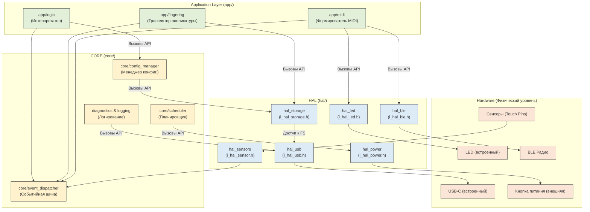
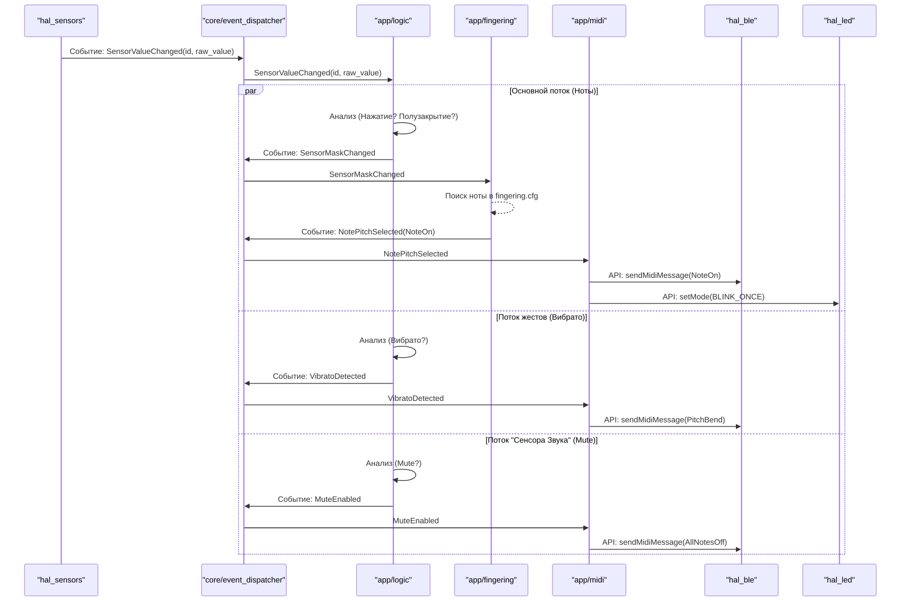
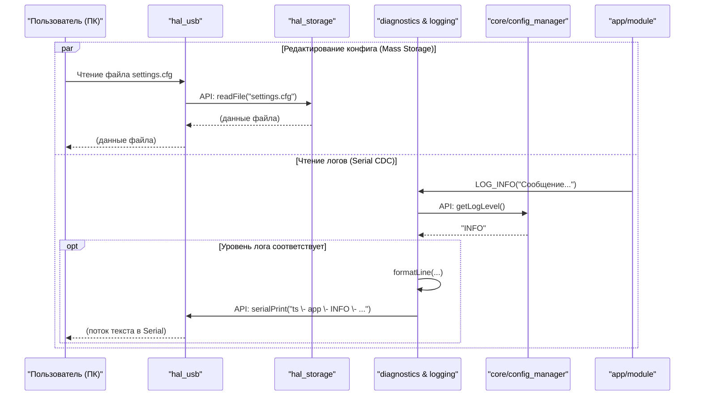
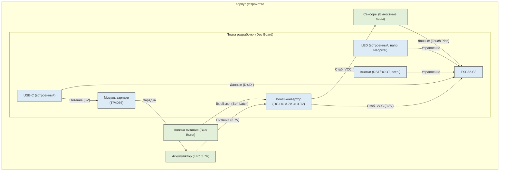
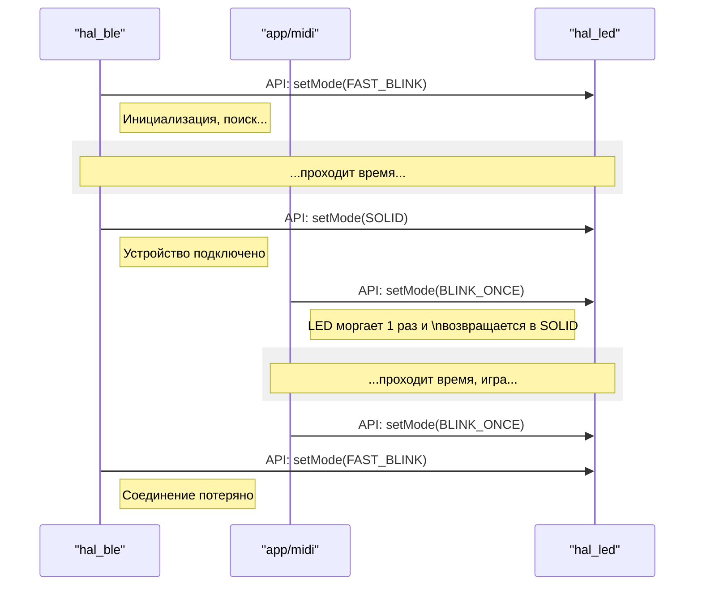

# **Архитектурные диаграммы**

**Назначение документа:** \> Этот документ визуализирует архитектурные решения, описанные в ARCH_CONTRACT.MD, с использованием диаграмм Mermaid. Он служит для наглядного представления статической структуры и динамического взаимодействия модулей.

## **1\. Компонентная диаграмма (C4 \- Уровень 3\)**

Эта диаграмма показывает основные модули (HAL, APP, CORE) и их ключевые зависимости.

## **2\. Диаграммы последовательности (Sequence Diagrams)**

### **Сценарий 1: Основной сценарий (BLE MIDI) \- (Обновлено)**

Эта диаграмма показывает "горячий путь" (hot path) и параллельную обработку "сенсора звука".

### **Сценарий 2 и 3: Композитное USB (Конфигурация и Логирование)**

Эта диаграмма показывает *одновременную* работу двух функций композитного USB-устройства.

## **3\. Диаграмма физической компоновки (C4 \- Уровень 1\) \- (Обновлено)**

Эта диаграмма показывает физические компоненты устройства и их взаимосвязи, учитывая использование встроенных компонентов платы ESP32-S3.

## **4\. Диаграмма управления LED (Сценарий 4\) \- (Исправлено)**

Эта диаграмма показывает, как разные модули управляют состоянием одного светодиода.

